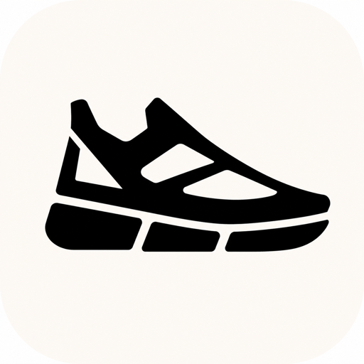

<div align="center">

<h1>
  
  <br>
  RunBuild
</h1>

**RunBuild** is a local-first, project-bound workbench for coding agents. It
binds each project to a real working directory, starts isolated project
runners, restores ACP sessions, and exposes tool activity and write approval
through a Web or desktop client.

[Run locally](#runbuild-local-workbench) ·
[WebUI guide](webui/README.md) ·
[Upstream runtime](#upstream-grok-build-runtime) ·
[Repository layout](#repository-layout) ·
[Development](#development) ·
[License](#license)

</div>

---

## RunBuild local workbench

Start the Web client with an authenticated local Agent bridge:

```sh
./run web-agent
```

Or launch the Electron desktop client:

```sh
./run desktop
```

RunBuild starts Grok 4.5 by default and keeps model credentials outside the
page process. Grok uses the current RunBuild login or an explicitly provided
`XAI_API_KEY`; MiMo and DeepSeek remain available through explicit profiles.
See [`webui/README.md`](webui/README.md) for service lifecycle, project,
session, and sandbox details.

## Upstream Grok Build runtime

RunBuild uses SpaceXAI's **Grok Build** terminal coding-agent runtime. Grok
Build runs as a full-screen TUI, headlessly for scripting or CI, and through
the Agent Client Protocol (ACP). The upstream `grok` CLI, `xai-grok-*` crates,
configuration paths, and protocol identifiers retain their original names for
compatibility.


**Learn more about Grok Build at [x.ai/cli](https://x.ai/cli)**

This repository contains the upstream Rust source for the `grok` CLI/TUI and
its agent runtime alongside the local RunBuild clients. The upstream source is
synced periodically from the SpaceXAI monorepo.

A small `SOURCE_REV` file at the root records the full monorepo commit SHA
for the version of the code present in this tree.

## Installing the upstream CLI

Prebuilt binaries are published for macOS, Linux, and Windows:

```sh
curl -fsSL https://x.ai/cli/install.sh | bash   # macOS / Linux / Git Bash
irm https://x.ai/cli/install.ps1 | iex          # Windows PowerShell
grok --version
```

See the [changelog](https://x.ai/build/changelog) for the latest fixes,
features, and improvements in each release.

## Building the upstream runtime from source

Requirements:

- **Rust** — the toolchain is pinned by [`rust-toolchain.toml`](rust-toolchain.toml);
  `rustup` installs it automatically on first build.
- **[DotSlash](https://dotslash-cli.com)** — required so hermetic tools under
  [`bin/`](bin/) (notably [`bin/protoc`](bin/protoc)) can download and run.
  Install it and ensure `dotslash` is on your `PATH` **before** building:

  ```sh
  cargo install dotslash
  # or: prebuilt packages — https://dotslash-cli.com/docs/installation/
  /usr/bin/env dotslash --help   # sanity check
  ```

- **protoc** — proto codegen resolves [`bin/protoc`](bin/protoc) via DotSlash,
  or falls back to a `protoc` on `PATH` / `$PROTOC`.
- macOS and Linux are supported build hosts; Windows builds are best-effort
  and not currently tested from this tree.

```sh
cargo run -p xai-grok-pager-bin              # build + launch the TUI
cargo build -p xai-grok-pager-bin --release  # release binary: target/release/xai-grok-pager
cargo check -p xai-grok-pager-bin            # fast validation
```

The binary artifact is named `xai-grok-pager`; official installs ship it as
`grok`. On first launch it opens your browser to authenticate — see the
[authentication guide](crates/codegen/xai-grok-pager/docs/user-guide/02-authentication.md).

## Upstream runtime documentation

Full online documentation is available at
[docs.x.ai/build/overview](https://docs.x.ai/build/overview).

The user guide ships with the pager crate:
[`crates/codegen/xai-grok-pager/docs/user-guide/`](crates/codegen/xai-grok-pager/docs/user-guide/)
— getting started, keyboard shortcuts, slash commands, configuration, theming,
MCP servers, skills, plugins, hooks, headless mode, sandboxing, and more.

## Repository layout

| Path | Contents |
|------|----------|
| `webui` | RunBuild React, Vite, and Electron client |
| `run` | Local RunBuild launcher for Web, desktop, and Agent modes |
| `crates/codegen/xai-grok-pager-bin` | Composition-root package; builds the `xai-grok-pager` binary |
| `crates/codegen/xai-grok-pager` | The TUI: scrollback, prompt, modals, rendering |
| `crates/codegen/xai-grok-shell` | Agent runtime + leader/stdio/headless entry points |
| `crates/codegen/xai-grok-tools` | Tool implementations (terminal, file edit, search, ...) |
| `crates/codegen/xai-grok-workspace` | Host filesystem, VCS, execution, checkpoints |
| `crates/codegen/...` | The rest of the CLI crate closure (config, MCP, markdown, sandbox, ...) |
| `crates/common/`, `crates/build/`, `prod/mc/` | Small shared leaf crates pulled in by the closure |
| `third_party/` | Vendored upstream source (Mermaid diagram stack) — see below |

> [!IMPORTANT]
> The root `Cargo.toml` (workspace members, dependency versions, lints,
> profiles) is **generated** — treat it as read-only. Prefer editing per-crate
> `Cargo.toml` files.

## Development

```sh
cargo check -p <crate>        # always target specific crates; full-workspace builds are slow
cargo test -p xai-grok-config # per-crate tests
cargo clippy -p <crate>       # lint config: clippy.toml at the repo root
cargo fmt --all               # rustfmt.toml at the repo root
```

## Contributing

> [!NOTE]
> External contributions are not accepted. See [`CONTRIBUTING.md`](CONTRIBUTING.md).

## License

First-party code in this repository is licensed under the **Apache License,
Version 2.0** — see [`LICENSE`](LICENSE).

Third-party and vendored code remains under its original licenses. See:

- [`THIRD-PARTY-NOTICES`](THIRD-PARTY-NOTICES) — crates.io / git dependencies,
  bundled UI themes, and **in-tree source ports** (including openai/codex and
  sst/opencode tool implementations)
- [`crates/codegen/xai-grok-tools/THIRD_PARTY_NOTICES.md`](crates/codegen/xai-grok-tools/THIRD_PARTY_NOTICES.md)
  — crate-local notice for the codex and opencode ports (license texts +
  Apache §4(b) change notice)
- [`third_party/NOTICE`](third_party/NOTICE) — vendored Mermaid-stack index
